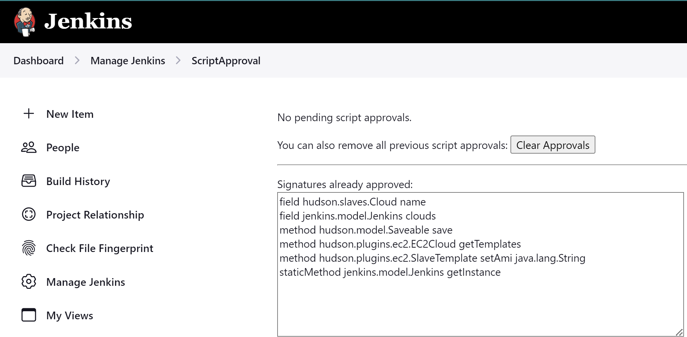

# Jenkins EC2 AMI Update Job README

This README provides instructions for setting up and running a Jenkins job to update the AMI ID of a specific EC2 cloud using a Jenkins Pipeline script.

## 1. Steps to Create the Jenkins Job

Follow these high-level steps to create a Jenkins Pipeline job using the provided DSL script:

1. **Navigate to Jenkins**: Open your Jenkins instance in a web browser.

2. **Create New Item**: Click on "New Item" in the Jenkins dashboard.

3. **Select Job Type**: Choose "Pipeline" and enter a name for the job.

4. **Configure Pipeline**: In the job configuration, scroll to the "Pipeline" section.

5. **Enter Pipeline Script**: Paste the below DSL script into the "Pipeline script" field, or specify the path to a Jenkinsfile if the script is stored in source control.

[DSL Script](./update-ec2-plugin.groovy)

6. **Save**: Click "Save" to create the job.

## 2. In-process Script Approval Steps

Due to Jenkins’ script security model, certain method calls in the script require administrator approval:

1. **Run the Job**: Initially, the job will fail due to script security restrictions.
2. **Navigate to Script Approval**: Go to "Manage Jenkins" → "In-process Script Approval".
3. **Approve Scripts**: Approve the following signatures:
   - `field hudson.slaves.Cloud name`
   - `field jenkins.model.Jenkins clouds`
   - `method hudson.model.Saveable save`
   - `method hudson.plugins.ec2.EC2Cloud getTemplates`
   - `method hudson.plugins.ec2.SlaveTemplate setAmi java.lang.String`
   - `staticMethod jenkins.model.Jenkins getInstance`

   

4. **Rerun the Job**: After approval, rerun the job.

## 3. Running the Script

To run the script, execute the created Jenkins job and provide the following parameters:

- **CLOUD_NAME**: The name of the EC2 cloud configuration you want to update.
- **NEW_AMI_ID**: The new AMI ID to set for the specified EC2 cloud.
