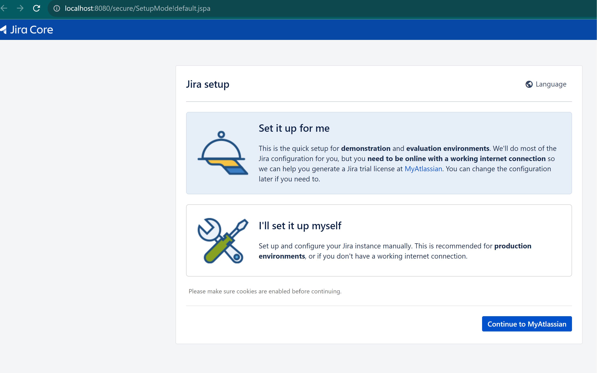

# JIRA Docker Compose Setup

This README provides information about setting up JIRA using Docker Compose. It includes prerequisites, an introduction to JIRA, the function of the Docker Compose file, and basic usage instructions.

## 0. Pre-requisites

Before you begin, make sure you have the following installed on your system:

- Docker: [Installation Guide](https://docs.docker.com/get-docker/)
- Docker Compose: [Installation Guide](https://docs.docker.com/compose/install/)

## 1. What is JIRA?

JIRA is a project management tool developed by Atlassian. It's widely used for issue tracking, project management, and agile software development. JIRA lets teams plan, track, and manage software development projects, customize workflows, and track issues and bugs.

## 2. What Does This Compose File Do?

This `docker-compose.yml` file sets up JIRA with two services:

- **JIRA Software**: The main JIRA application.
- **PostgreSQL**: A database server for JIRA data storage.

The file handles configurations like environment variables, volume mappings, and service dependencies.

## 3. Basic Usage

To set up JIRA using this Docker Compose file:

1. **Create Docker Compose File**: Save the `docker-compose.yml` content in a file named `docker-compose.yml`.

2. **Start Services**: Run `docker-compose up -d` in the directory with your `docker-compose.yml`.

3. **Access JIRA**: After the services start, visit `http://localhost:8080` in your browser.

4. **Shutdown and Cleanup**: Use `docker-compose down -v` to stop and remove the containers, networks, and volumes.

**Note**: Replace default credentials and other sensitive data in the Docker Compose file with secure settings for production use.

## Intial Page once container started

## Setup page

