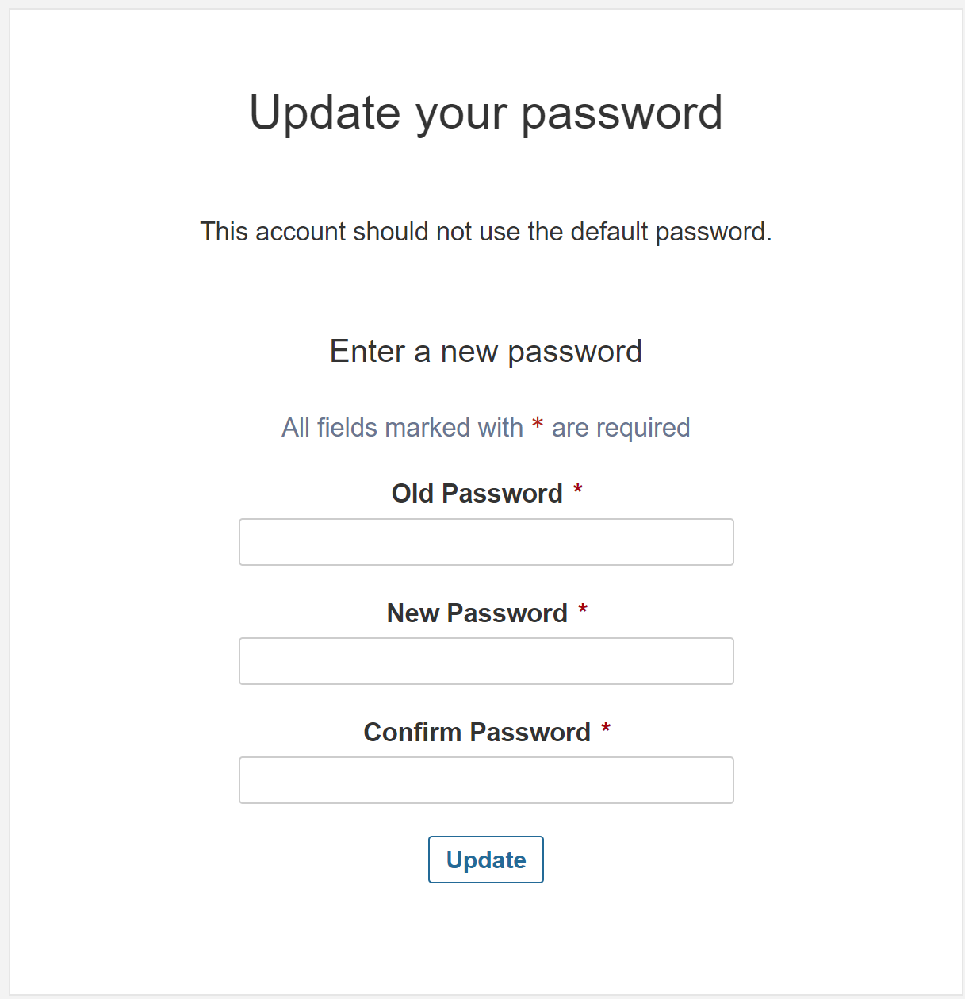

# SonarQube Community Edition - README

## Introduction to SonarQube

SonarQube is an open-source platform developed for continuous inspection of code quality. It performs automatic reviews with static analysis of code to detect bugs, code smells, and security vulnerabilities.

### Why SonarQube Community Edition?

- **Cost-Effective**: Being an open-source tool, it's free to use, making it ideal for individuals, small teams, or organizations looking to save costs.
- **Comprehensive Code Analysis**: Offers a wide range of language support and has robust capabilities for code quality and security analysis.
- **Community Support**: Benefits from a large community of users and developers who contribute to its ongoing improvement and support.
- **Ease of Integration**: Easily integrates with existing development workflows and tools.
- **Educational**: Helps developers learn best practices and improve their coding skills.

## Prerequisites

To run this Docker Compose file for SonarQube, you will need:

1. **Docker**: Ensure Docker is installed on your system.
2. **Docker Compose**: Docker Compose should be installed for orchestrating multi-container Docker applications.
3. **Hardware Requirements**: Adequate memory and CPU resources for running both the SonarQube and PostgreSQL containers.

## Running the Docker Compose File

### Steps to Run

1. **Clone or Download**: Firstly, clone or download the provided Docker Compose file to your local system.
2. **Navigate to Directory**: Open a terminal and navigate to the directory containing the Docker Compose file.
3. **Execute Docker Compose**:

```bash
   docker-compose up -d
```

This command starts the containers in detached mode.

Access SonarQube:

Once the containers are up, SonarQube will be accessible at http://localhost:9000.
Default credentials are admin/admin.
Configuration (Optional): Configure SonarQube as per your project needs.


